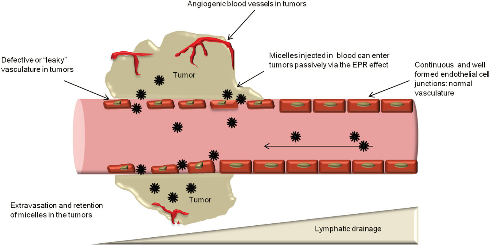
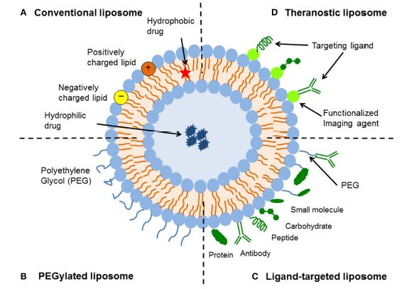

# Chapter 27: Nanotechnology in Cancer

Nanotechnology has emerged as a revolutionary approach in oncology, offering unprecedented opportunities to address the fundamental challenges of cancer diagnosis and treatment. The intrinsic limits of conventional cancer therapies prompted the development and application of various nanotechnologies for more effective and safer cancer treatment. Cancer nanomedicine represents the convergence of nanotechnology, molecular biology, and clinical oncology, creating multifunctional platforms that can simultaneously target, diagnose, and treat malignancies with enhanced precision and reduced toxicity.

The ultimate goal of nanomedicine has always been the generation of translational technologies that can ameliorate current therapies. Cancer disease represented the primary target of nanotechnology applied to medicine, since its clinical management is characterized by very toxic therapeutics. The unique physicochemical properties of nanoparticles, particularly their size-dependent behavior and ability to exploit tumor pathophysiology, have created new paradigms for drug delivery, imaging, and combination therapies.

The field encompasses diverse nanoplatforms including organic nanoparticles (NPs) such as liposomes and polymeric systems, inorganic NPs including quantum dots and gold nanoparticles (AuNPs), and hybrid systems that combine the advantages of multiple materials. Organic NPs have been vastly explored for several years and fabricated with organic compounds like lipids, protein, carbohydrates, and other organic compounds. Polymer-based NPs, liposome-based NPs, and dendrimers are extensively used as organic NPs in cancer treatment.

This chapter provides a comprehensive overview of nanotechnology applications in cancer, focusing on drug delivery systems, imaging modalities, and theranostic platforms that integrate both diagnostic and therapeutic functionalities within single nanoformulations.

## 27.1 Nanoparticles for Drug Delivery

Nanotechnology has emerged as a transformative approach in cancer treatment, offering unprecedented opportunities to overcome the limitations of conventional therapeutic modalities. Cancer nanotherapeutics are rapidly progressing and are being implemented to solve several limitations of conventional drug delivery systems such as nonspecific biodistribution and targeting, lack of water solubility, poor oral bioavailability, and low therapeutic indices.

### 27.1.1 Fundamentals of Nanoparticle Drug Delivery

**Enhanced Permeability and Retention Effect**

  

<em><strong> Figure 27.1 Enhanced permeability and retention effect: </strong>  Nanocarriers can extravasate into the tumors through the gaps between endothelial cells and accumulate there due to poor lymphatic drainage.  <small> Source: Aditi M. Jhaveri and Vladimir P. Torchilin Front. Pharmacol., Volume 5 - 2014 | https://doi.org/10.3389/fphar.2014.00077 via Wikimedia Commons </small></em>

Nanoparticles exploit the unique pathophysiology of tumors, particularly the enhanced permeability and retention (EPR) effect. This phenomenon arises from:

* **Abnormal tumor vasculature**: Tumor blood vessels are typically more permeable than normal vessels due to incomplete endothelial cell junctions and reduced pericyte coverage
* **Defective lymphatic drainage**: Impaired lymphatic function in tumors leads to reduced clearance of extravasated materials
* **Size-dependent accumulation**: Nanoparticles in the optimal size range (10-150 nm) can extravasate through leaky tumor vasculature while being retained in the tumor microenvironment

**Passive vs. Active Targeting**

*Passive Targeting*:
* Relies on the EPR effect for tumor accumulation
* Size and surface characteristics determine circulation time and biodistribution
* Stealth properties achieved through polyethylene glycol (PEG) coating to evade immune recognition

*Active Targeting*:
* Employs specific ligands or antibodies directed against tumor-specific receptors
* Amplifies specificity of therapeutic nanoparticles
* Enhances cellular uptake and internalization by cancer cells

### 27.1.2 Types of Nanoparticle Drug Delivery Systems

**Liposomal Drug Delivery Systems**

Liposomes are lipid spheres about 100 nanometers in diameter that have been synthesized for improved delivery of therapeutic agents. Liposome, the first nano-scale drug approved for clinical application, consists of an outer lipid layer and a core entrapping either hydrophobic or hydrophilic drug. They offer several advantages:

* **Biocompatibility**: Composed of naturally occurring lipids
* **Versatile drug loading**: Can encapsulate both hydrophilic and lipophilic drugs
* **Controlled release**: Permit continued drug release with increased precision in tumor-targeting
* **Reduced toxicity**: Demonstrated clinical success in reducing systemic toxicity

  

  

<em><strong> Figure 27.2 Schematic representation of the different types of liposomal drug delivery systems. </strong>   <small> Source: Sercombe, Veerati, Moheimani, Wu, Sood and Hua Front. Pharmacol., Volume 6 - 2015 | https://doi.org/10.3389/fphar.2015.00286 via Wikimedia Commons </small></em>

*Advanced Liposomal Formulations*:
The PEG (polyethylene glycol) is a hydrophilic polymer that prevents the liposome from recognizing subsequent clearance. Improved pharmacokinetic characteristics, regulated and prolonged drug release, and, most importantly, decreased systemic toxicity are all provided by LNPs. Modern liposomal systems include:

- **PEGylated liposomes**: Enhanced circulation time and reduced immunogenicity
- **Targeted liposomes**: Surface-modified with antibodies or ligands for active targeting
- **Stimuli-responsive liposomes**: pH, temperature, or enzyme-triggered drug release
- **Combination liposomes**: Co-delivery of multiple therapeutic agents

*Clinical Applications*:
In the field of breast and prostate cancer, the application of liposomes has been increasingly common. Multiple paclitaxel liposomes have been demonstrated to have higher anti-tumor efficiency and improved bioavailability compared to free paclitaxel. Liposomes have been used to encapsulate anticancer drugs for the treatment of AIDS-related Kaposi's sarcoma. In melanoma models, phosphatidylethanolamine liposomal cisplatin was proven to have higher cytotoxicity than classic liposomes or free cisplatin, maintaining high intratumoral drug concentration for 72 hours and efficiently delivering 3.6-times more drug compared to the free drug.

**Polymeric Nanoparticles**

Polymeric nanoparticles (NPs) play an important role in controlled cancer drug delivery. Anticancer drugs can be conjugated or encapsulated by polymeric nanocarriers, which are known as polymeric nanomedicine. Polymeric nanoparticles (PNs) are molecules usually organized with tunable size into a dense structure with entangling biodegradable polymers presenting thermodynamic stability in an aqueous solvent. The FDA (Food and Drug Administration) has approved three PNs: polylactic acid (PLA), poly(lactic-co-glycolic acid) (PLGA), and polycaprolactone (PCL).

*Advantages*:
Due to their nature, they make possible the customization of many properties, such as hydrophobicity, molecular weight and biodegradability. All of them are completely biocompatible and biodegradable, and have acknowledged degradation curves, making the drug release process of these nanocarriers more accessible to be customized

- Controlled drug release kinetics
- Biodegradable and biocompatible
- Tunable surface properties through copolymer modification
- Protection of encapsulated drugs from degradation

*Advanced Polymeric Systems*:

**Polymersomes**: Polymersomes are a kind of supramolecular aggregates formed by the self-assembly of amphiphilic molecules. As drug carriers, polymersomes modify the distribution of drugs in body, prevent drug degradation and inactivation, extend the action time of drugs, and reduce side effects. These vesicular structures offer:

- Superior stability compared to liposomes
- Controllable membrane thickness and permeability
- Ability to deliver both hydrophilic and hydrophobic drugs
- Stimuli-responsive capabilities including pH, temperature hydrolysis, oxidation, reduction, light, and so on

**Polymeric Micelles**: Self-assembled structures from amphiphilic block copolymers that provide:

- Enhanced solubilization of hydrophobic drugs
- Core-shell architecture for drug encapsulation
- Active targeting through surface modification
- Improved pharmacokinetics and biodistribution

*Clinical Success*:
Albumin-bound (nab)-paclitaxel NPs (Abraxane®) were approved in 2012 by the US Food and Drug Administration (FDA) for cancer treatment. It has been used since then for the treatment of a large list of cancer including non-small cell lung carcinoma, metastatic breast cancer and pancreatic cancer.

*PEGylation Strategy*:
Copolymers such as polyethylene glycol (PEG) have been used to reduce degradation rate and improve biocompatibility, creating PLA-PEG and PLGA-PEG formulations that evade immune response and extend circulation time.

**Hybrid Nanoparticles**

Hybrid NPs combine the advantages of different NPs, thereby enhancing the function and stability of each drug delivery system. These advanced systems represent the next generation of nanomedicine platforms.

*Lipid-Polymer Hybrid Nanoparticles (LPHNPs)*:
LPHNPs are advanced core–shell nanoconstructs with a polymeric core region enclosed by a lipidic layer, presumed to be derived from both liposomes and polymeric nanounits. Key advantages include:

- High biocompatibility of lipids with the structural integrity provided by polymer NPs, capable of encapsulating both hydrophilic and hydrophobic drugs
- Stability, high loading of cargo, increased biocompatibility, rate-limiting controlled release, and elevated drug half-lives as well as therapeutic effectiveness while minimizing their drawbacks
- Effective internalization by cancer cells and avoidance of fast clearance by the reticuloendothelial system

*Clinical Applications of Hybrid Systems*:
Lipid-polymer hybrid NPs have been demonstrated to be a promising drug delivery platform in the treatment of pancreatic cancer, breast cancer, and metastatic prostate cancer.

*Organic-Inorganic Hybrid Nanoparticles*:
The combination of organic and inorganic hybrid nano-materials is a common method of NP design. For example, a liposome-silica hybrid (LSH) nanoparticle consists of a silica core and a surrounding lipid layer.

**Carbon-Based Nanoparticles**

Carbon-based nanoparticles are effective in melanoma cells. A single-walled carbon nanotube loaded with doxorubicin induced melanoma cell death in a dose-dependent manner in vitro and reduced tumor development in a xenograft melanoma model.

*Properties*:
* High surface area for drug loading
* Excellent electrical and thermal conductivity
* Potential for photothermal therapy applications
* Challenges with biocompatibility and clearance

**Inorganic Nanoparticles**

*Gold Nanoparticles (GNPs)*:
Gold nanoparticles are known as nontoxic, highly stable, easy to synthesize, and minimally interfering with the biological profile of melanoma tumor cells. Being of high atomic number and electron density, GNPs are optimal contrast agents for computed tomography.

*Mesoporous Silica Nanoparticles (MSNPs)*:
Mesoporous silica nanoparticles have high drug loading due to high pore volume and surface area, multifunctionalization for targeted and controlled delivery, enhanced cellular uptake and delivers therapeutics at cellular levels in cancer.

*Magnetic Nanoparticles*:
* Iron oxide nanoparticles for MRI contrast enhancement
* Potential for magnetic hyperthermia therapy
* Targeted delivery using external magnetic fields

### 27.1.3 Overcoming Drug Resistance

**Mechanisms of Drug Resistance**

The mechanisms of cancer drug resistance include overexpression of drug efflux transporters, defective apoptotic pathways, and hypoxic environment. Cancer drug resistance represents one of the most significant challenges in oncology, with over 50% of the anticancer drugs used in the clinic today targeted by P-glycoprotein (P-gp).

**ATP-Binding Cassette (ABC) Transporters**:
A distinct and predominant mechanism of drug resistance found in cancer cells is the overexpression of specific efflux pumps. These efflux pumps are part of the ABC superfamily of transporters and can translocate substrates (drugs) from the inside to the outside of the cell, thereby reducing intracellular drug accumulation. Key resistance mechanisms include:

- **P-glycoprotein (P-gp)**: P-gp can efflux various anticancer drugs such as doxorubicin and paclitaxel out of cancer cells. Overexpression of P-gp is a common feature of most acquired MDR (Multidrug Resistance) in solid tumors
- **Multidrug Resistance-Associated Protein 1 (MRP1)**: Contributes to drug efflux and resistance
- **Breast Cancer Resistance Protein (BCRP)**: Another major efflux transporter

**Nanoparticle-Based Solutions**

*Bypassing Efflux Pumps*:
Considering different mechanisms of drug resistance in cancer, nanoparticles are always designed to inhibit or bypass efflux pumps on the membrane or to enhance endocytosis when recognizing MDR tumors. Strategies include:

- **Endocytic Uptake**: Nanoparticles targeting these mechanisms can lead to an improvement in the reversal of multidrug resistance
- **Co-delivery Systems**: Nano-codelivery systems that can transport traditional chemotherapy drugs and multiple MDR transporter inhibitors. These systems function by interfering with the "efflux pump" functions of cell membrane transporters
- **Size-dependent Mechanisms**: Nanoparticles can deliver drugs directly to intracellular compartments, bypassing membrane transporters

*Multi-compound Nanoparticles*:
Nanoparticles capable to encapsulate or bind multiple compounds at once and release the drugs at the target site either simultaneously or in a predetermined sequence. A novel polymer lipid hybrid nanoparticle (PLN) system was able to circumvent drug resistance. Dox-MMC co-loaded PLN were 20-30-folds more effective in killing MDR cells than free drugs.

*Gene Silencing Approaches*:
Strategies to overcome multi drug resistance by silencing the expression of gene encoding P-gp efflux transporter, i.e., MDR-1 or Survivin through RNA interference (RNAi) or small interfering RNA (siRNA) has been explored. The mechanisms include:

- **siRNA Delivery**: The siRNAs assembles into endoribonuclease inside the cells containing complexes known as RNA-Induced Silencing Complexes (RISCs) which guides the RISCs to complementary RNA molecules, cleaving and destroying the target RNA
- **Combined Therapeutic Approaches**: Biotin-functionalized nanoparticles co-encapsulating paclitaxel and P-gp targeted siRNA partially overcame tumor drug resistance

*Oxidative Stress Modulation*:
Restoring the oxidative stress sensitivity of MDR cells to enhance the cytotoxicity of antitumor drugs, as well as identifying novel targets to restore cancer cell response to chemotherapies and immunotherapies, may serve as potential therapeutic strategies to overcome MDR.

**Clinical Examples of MDR Reversal**:

*Mesoporous Silica Systems*:
Doxorubicin MSNPs surface conjugated with TAT peptide facilitated intranuclear drug localization in multidrug resistant MCF-7/ADR cancer cells and overcome MDR compared to free Doxorubicin.

*PLGA-based Systems*:
Biotin or folic acid functionalized PLGA nanoparticles encapsulating Tariquidar and Paclitaxel resulted in higher cytotoxicity and inhibited tumor growth in human MDR tumor xenografts compared to Paclitaxel nanoparticles alone.

*Liposomal Co-delivery*:
Transferrin coated liposomes co-encapsulating Doxorubicin and Verapamil exhibited 5 and 3-fold cytotoxicity in Doxorubicin-resistant human erythroleukemia K562 cells compared to non-targeted liposomes and transferrin targeted liposomes with Doxorubicin alone respectively.

### 27.1.4 Clinical Translation and Challenges

**Approved Nanotherapeutics**

Several nanotechnology-based cancer drug therapies have been approved by the FDA and are already on the market. There are five clinically approved nanoparticle chemotherapeutics for cancer and many more under clinical investigation. These include:

- **Doxil®** (liposomal doxorubicin): Doxil was the first nanotherapeutic approved to treat cancer, and it is used for treating ovarian cancer, AIDS-related Kaposi's sarcoma, and multiple myeloma
- **Abraxane®** (albumin-bound paclitaxel nanoparticles): Approved in 2012 by the US Food and Drug Administration (FDA) for cancer treatment for non-small cell lung carcinoma, metastatic breast cancer and pancreatic cancer
- **DaunoXome®** (liposomal daunorubicin)
- 
**Translation Challenges**

*Biological Barriers*:
Mucosal barriers and non-specific absorption are just a few of the challenges encountered in employing nanocarriers for cancer therapy. To overcome these obstacles, a combination of rational nanocarrier design and a fundamental understanding of tumor biology is needed.

The main limitations of nanodrug efficacy are the immunological interactions, the biological barriers that hinder the availability of nanodrugs to the intended target, and the heterogeneity of the biological target.

*Manufacturing and Regulatory Hurdles*:
Issues surrounding complexity in manufacturing and characterization, lack of understanding of in vivo pharmacokinetics and pharmacodynamics, acute and chronic toxicity, and cost-effectiveness present significant challenges.

Although diverse nanocarriers have traversed preclinical phases and garnered approvals for human trials, a mere fraction have secured authorization for clinical deployment, particularly those with molecular moieties designed for selective cancer cell interactions.

*Bio-Corona Formation*:
In the biological system, nanomaterials interact with all the encountered biomolecules and dynamically form the so called "bio-corona." The commonly agreed definition of the bio-corona is the multitude and the variety of biomolecules that associate with the surface of a nanoparticle when introduced in a biological system.

**Current Clinical Landscape**:
In 2016, we published a review article on the current clinical landscape of therapeutic nanoparticles, which highlighted over 25 Food and Drug Administration (FDA) or European Medicines Agency (EMA) approved nanomedicines and over 45 other nanoparticle technologies that were not FDA/EMA approved but were currently being evaluated in ongoing clinical trials.

*Recent Progress*:
With the integration of nanotechnology into the medical field at large, great strides have been made in the development of nanomedicines for tackling different diseases, including cancers. However, the translation from bench to bedside remains challenging.

**Future Opportunities**

*Precision Medicine Integration*:
By gaining a deeper insight into nano–bio interactions and the personalization of nanomedicines, and through the application of nanotechnology to existing and emerging therapeutic modalities, we will begin to realize the true potential of nanomedicine in cancer.

*Advanced Manufacturing*:

- Continuous manufacturing processes
- Quality by design approaches
- Automated production systems

## 27.2 Nanomaterials for Imaging and Diagnosis

Recent advances in nanotechnology, accompanied by our growing understanding of cancer biology and nano-bio interactions, have led to the development of a series of nanocarriers, which aim to improve the therapeutic efficacy while reducing off-target toxicity. Nanomaterials have revolutionized medical imaging by providing superior contrast, specificity, and sensitivity compared to conventional imaging agents. These materials exploit unique physicochemical properties at the nanoscale to enhance diagnostic capabilities.

### 27.2.1 Quantum Dots for Cancer Imaging

**Fundamental Properties**

Quantum dots (QDs) are the luminescent nanocrystals (NCs) that provide a multifunctional platform for imaging the biosystems following controlled delivery of therapeutic drugs, proteins, peptides, oligonucleotides, and genes. Quantum dots (QDs) are semiconductor nanocrystals that emit fluorescence on excitation with a light source. Quantum dots (QDs) are nanoscale nanomaterials that are said to be zero-dimensional because charge carriers are confined so tightly in three directions. Many of their unique properties arise because semiconducting nanocrystals from 2–10 nm diameter are smaller than or equal to their exciton Bohr radius.

*Unique Optical Characteristics*:
Flexible surface chemistry, unique optical properties, high sensitivity, and multiplexing capabilities of QDs certainly make them a most promising tool for personalized medicine:

- Size-tunable emission wavelengths due to quantum confinement effects
- Broad absorption spectra with narrow, symmetric emission peaks
- Superior photostability compared to organic fluorophores
- High quantum yields and brightness

**Cancer Detection Applications**

QDs might serve as potential, more sensitive and specific methods of detection than conventional methods applied in cancer molecular targeting and bio-imaging. The advantages over conventional imaging include:

*Enhanced Sensitivity*:

- Detection of single molecules and small cell populations
- Superior signal-to-noise ratio
- Resistance to photobleaching allows long-term imaging

*Multiplexed Imaging*:
Because of quantum confinement effects, QDs can be excited by a single wavelength but emit at different wavelengths depending on their size, enabling simultaneous detection of multiple targets.

**Advanced Quantum Dot Systems**

*Carbon Quantum Dots (CQDs)*:
Carbon-based quantum dots (CQDs) have been shown to have promising application value in tumor diagnosis. These biocompatible alternatives offer:

- pH-triggered drug release, and can be used for theranostic purposes. Nitrogen and sulphur doping has been beneficial for extended imaging
- Biocompatible, facilitate pH-triggered drug release, and can be used for theranostic purposes
- Reduced toxicity compared to semiconductor QDs

*Graphene Quantum Dots (GQDs)*:
Graphene quantum dots (GQDs) were conjectured to produce new or improve current methods used for bioimaging, drug delivery, and biomarker sensors for early detection of diseases. Applications include:

- Quinic acid conjugated N-CQDs showed interesting features like tumor accumulation and luminescence, indicating that they might be useful as multifunctional theranostic agents
- Combined imaging and drug delivery capabilities

**In Vivo Tumor Targeting**

Multifunctional nanoparticle probes based on semiconductor quantum dots (QDs) for cancer targeting and imaging in living animals have shown promising results. In vivo targeting studies of human prostate cancer growing in nude mouse show that the QD probes can be delivered to tumor sites by both enhanced permeation and retention (passive targeting) and by antibody binding to cancer-specific cell surface biomarkers such as prostate-specific membrane antigen (active targeting).

*Advanced Targeting Strategies*:
Carbon quantum dots, functionalized with multiple paired α-carboxyl and amino groups that bind to the large neutral amino acid transporter 1 (which is expressed in most tumors), selectively accumulate in human tumour xenografts in mice.

*Clinical Applications*:

- Sentinel lymph node mapping in cancer staging
- Real-time surgical guidance
- Monitoring of therapeutic response

### 27.2.2 Magnetic Nanoparticles for MRI Enhancement

**Iron Oxide Nanoparticles**

The development of nano-imaging through fluorescent imaging and magnetic resonance imaging (MRI) has the potential to detect and diagnose cancer at an earlier stage than with current imaging methods.

*Contrast Enhancement Mechanisms*:
* T1 and T2 relaxation time modification
* Concentration-dependent signal enhancement
* Tissue-specific accumulation patterns

**Clinical Applications**

*Lymph Node Metastasis Detection*:
In the recent MELAMAG clinical trial, sentinel lymph node biopsy detection based on magnetic nanoparticles was compared to the standard technique. From 129 recruited patients, the study reported 95.3% rate of sentinel node identification using this magnetic nanoparticle-based technique.

*Advanced Magnetic Systems*:
Ultrahigh field magnetic resonance imaging (UHF-MRI) (≥7 T) can dramatically boost image resolution and signal-to-noise ratio. The hybrid nanoparticles exhibited better tumor accumulation, a suitable time imaging window, and excellent pH-response T1-T2 dual-mode UHF-MRI performance.

*Advantages over Conventional Contrast Agents*:

- Longer circulation times
- Enhanced tissue specificity
- Potential for therapeutic applications

### 27.2.3 Gold Nanoparticles for CT Imaging

**Contrast Enhancement Properties**

Being of high atomic number and electron density, GNPs are optimal contrast agents for computed tomography. When labeled with radioisotope indium-111 and conjugated with RGD ligands, GNPs were successfully used as radiotracers in experimental melanoma models.

*Applications*:
* Enhanced CT contrast for tumor delineation
* Dual-modality imaging (CT/fluorescence)
* Radiation therapy enhancement

### 27.2.4 Advanced Imaging Techniques

**Near-Infrared Fluorescence Imaging**

*Tissue Penetration*:
Near-infrared quantum dots enable deep tissue imaging due to:
* Reduced light scattering and absorption by biological tissues
* Minimal autofluorescence interference
* Enhanced penetration depth

**Molecular Imaging**

*Biomarker Detection*:
The urgent development of a novel approach for cancer detection and real-time monitoring is crucial in order to decipher the intricate molecular information responsible for tumor biological behaviors.

*Applications*:
* Protein expression monitoring
* Gene expression analysis
* Metabolic pathway visualization

## 27.3 Theranostics and Multifunctional Platforms

Theranostics, the integration of diagnostics and therapies, has become a new concept in the battles with various major diseases such as cancer. Theranostics represents the convergence of diagnostics and therapeutics in a single nanoplatform, enabling personalized medicine approaches through real-time monitoring of therapeutic efficacy.

### 27.3.1 Concept and Design Principles

**Definition and Scope**

Due to the variability and strong adaptability of cancer cells, they could adjust their structure or cell properties to adapt to the surrounding environment and continue to survive, which undoubtedly brings huge obstacles to treatment. However, a single functional nanoparticle drug delivery system seems not to be sufficient for diversified tumor treatment strategies.

The term theranostics was originally coined to describe a treatment platform that combined a diagnostic test with targeted therapy based on the test results. The current nanotheranostics utilize controlled drug vehicles and contain cargo, targeting ligands, and imaging labels for delivery to specific tissues, cells, or subcellular components.

**Multifunctional Design Requirements**

*Essential Components*:
Multifunctional nanoparticles integrate different functions to further expand the carrier's application, thus achieving two or more capacities:

- Therapeutic payload (drugs, genes, proteins)
- Imaging agents (fluorescent, magnetic, radioactive)
- Targeting ligands (antibodies, peptides, aptamers)
- Biocompatible carriers (liposomes, polymers, inorganic cores)

*Design Considerations*:

- Size optimization for EPR effect and cellular uptake
- Surface modification for prolonged circulation
- Controlled release mechanisms
- Biocompatibility and biodegradability

### 27.3.2 Theranostic Nanoplatforms

**Liposomal Theranostics**

By using nanoparticles for both diagnosis and treatment, theranostic nanomedicine has been advanced recently. Liposomes, exosomes, polymersomes, nanocrystals, nanotubes, and nanowires are among the commonly used nanoparticles and nanodevices, and endless combinations can be created with these nanostructures.

*Advantages*:

- High biocompatibility
- Versatile drug loading capacity
- Well-established manufacturing processes
- FDA-approved formulations available

**Advanced Theranostic Systems**

*Multifunctional Imaging-Guided Therapy*:
The theranostic potential of these PFH-NEs (perfluorohexane nanoemulsions) for contrast imaging of tumors and as a drug-delivery vehicle for therapeutic purposes were demonstrated for both in vitro and in vivo systems using a combination of photoacoustic, ultrasound and fluorescence imaging modalities.

*Pancreatic Cancer Theranostics*:
Theranostics are the next generation therapeutics with both imaging and treatment agents encapsulated in a single nanocarrier. HER-PGFIO showed the magnetic moment of 10emu/g, relaxivity (r2) of 773mM-1s-1 and specific absorption rate (SAR) of 183W/g.

**Polymeric Theranostic Systems**

*Nanohydrogels*:
Nanohydrogels are cross-linked hydrophilic soft polymers organized in a tridimensional network comprising a large fraction of water. This nanocarrier is promising for multimodality treatment, especially for peptides, proteins, and oligonucleotides, because of their hydrophilicity and efficient cell uptake.

*Polymersomes*:
Polymersome could be valuable for melanoma treatment owing to its benefits, such as robustness, increased drug loading, constancy, relatively longer in vivo circulation, and the possibility to design it for the delivery of multiple drugs.

**Inorganic Theranostic Platforms**

*Multifunctional Gold-Based Systems*:
Some metals, such as gold (Au) and Gadolinium (Gd), can have antitumor activity besides being an imaging tracer. Bimetallic theranostic nanoparticle, Bi2S3@BSA–Au–BSA–MTX–Cur, in which they used BSA to Bi2S3 nanoparticles by biomineralization and modified them with Au nanoparticles to deliver methotrexate (MTX) and curcumin. Gd-based nanoparticles (AGuIX) were successfully used as both MRI contrast agent and therapy in experimental animal models of melanoma metastases.

*Magnetic Theranostics*:
Red blood cells are attached to iron oxide nanoparticles pre-coated with chlorine e6, a photosensitizer, and then loaded with a chemotherapeutic drug, doxorubicin, to enable imaging-guided combined photodynamic and chemotherapy of cancer. The characteristic properties of nanoparticles result in their theranostic potential allowing for simultaneous detection of and treatment of the disease, particularly through magnetic hyperthermia therapy combined with MRI guidance.

*Mesoporous Silica Theranostics*:
Multifunctional mesoporous silica nanoparticles (M-MSNs) were designed and synthesized, then the photosensitizer chlorin e6 (Ce6) and antitumor drug doxorubicin (Dox) were adsorbed onto the M-MSNs. The cores of bifunctional Fe3O4-Au nanoparticles in the multifunctional nanocomposites enabled dual-modal MR and CT imaging.

### 27.3.3 Clinical Applications and Examples

**Personalized Cancer Treatment**

Real-Time Monitoring*:

- Therapeutic response assessment
- Drug distribution tracking
- Resistance mechanism identification
- Treatment optimization

**Specific Clinical Examples**

*Melanoma Theranostics*:
Another novel theranostic nanostructure for melanoma was a biodegradable photoluminescent polymer—poly (lactic acid) (BPLP-PLA) loaded with anti-BRAF V600E–specific drug (PLX4032) and muramyl peptide. The new immune-cell-mediated nanoparticle offers high hopes for melanoma imaging and treatment.

*Prostate Cancer Targeting*:
A multifunctional melanin-like polydopamine (PDA) nanocarrier decorated with a small-molecule PSMA (prostate-specific membrane antigen) inhibitor. Compared with the corresponding non-targeted probe, our targeted probe induced higher cellular uptake in vitro (6.5-fold) and more tumor accumulation in vivo (4.6-fold).

*Combination Therapy Platforms*:
A multifunctional nanoplatform, which is developed by covalently grafting core-shell structured upconversion nanoparticles (UCNPs) with nanographene oxide (NGO). A remarkably improved and synergistic therapeutic effect compared to PTT (photothermal therapy) or PDT (photodynamic therapy) alone is obtained.

*Radiation Therapy Enhancement*:
Nanoparticles can potentiate radiotherapy by specifically delivering radionuclides or radiosensitizers into tumors, therefore enhancing the efficacy while alleviating the toxicity of radiotherapy.

## 27.4 Emerging Technologies and Future Directions

**Smart Responsive Systems**

*Stimuli-Responsive Release*:

- pH-sensitive drug release in acidic tumor microenvironment
- Temperature-triggered release through hyperthermia
- Enzyme-cleavable linkages for targeted activation
- Light-activated therapeutic release

**Advanced Imaging Integration**

*Multimodal Imaging Capabilities*:
Seamless multimodal NSs (nanosystems) have potential to simultaneously target and monitor the tumor cells through homing and imaging/sensing devices and deliver the therapeutic agents. Modern theranostic platforms incorporate:

- MRI/PET (Positron Emission Tomography) dual imaging
- Fluorescence/photoacoustic combinations
- CT/ultrasound integration
- Real-time therapeutic monitoring

**Combination Therapies**

*Immunotherapy Integration*:
Researchers are applying nanotechnology to cancer immunotherapy toward the development of nanocarriers for delivery of cancer vaccines and chemo-immunotherapies. Cancer nanovaccines can be envisioned as nanocarriers co-delivering antigens and adjuvants.

*Multi-therapeutic Approaches*:
Multifunctional nanoparticles often attract researchers because of their ability to simultaneously carry two or more drugs of different polarities or different sizes. Examples include:

- Chemo-photodynamic therapy combinations
- Immunotherapy-chemotherapy platforms
- Gene therapy-drug delivery systems
- Multi-drug resistance reversal strategies

**Current Limitations**

*Manufacturing and Scalability*:
* Complex synthesis procedures
* Batch-to-batch variability
* Regulatory approval pathways
* Cost-effectiveness considerations

*Biological Barriers*:
While progress toward effective treatments for cancer is taking longer than expected, researchers are beginning to understand the obstacles that have prevented nanoparticles from significantly reducing the cancer death rate.

**Safety Considerations**

*Toxicity Assessment*:
Toxicological profile of nanoparticles should be robustly assessed. When systemically administered, nanostructures interact with various host biomolecules, and may trigger toxicity. Therefore, comprehensive in vitro cellular models call for evaluation of physicochemical properties, dose, and time of action of nanomaterials.

*Long-term Effects*:
* Biodistribution and clearance studies
* Chronic toxicity evaluation
* Environmental impact assessment

**Future Opportunities**

*Precision Medicine*:
* Patient-specific nanoparticle design
* Biomarker-guided therapy selection
* Real-time treatment adaptation

*Advanced Manufacturing*:
* Continuous manufacturing processes
* Quality by design approaches
* Automated production systems

**Regulatory Pathway Development**

*Standardization Needs*:
* Characterization methodologies
* Safety assessment protocols
* Efficacy evaluation criteria

The full power of nanotechnology will require an era of spectacular advances in the development of processes to integrate nanoscale components into devices, accompanied by the ability to do so reliably at low cost.

The field of nanotechnology in cancer continues to evolve rapidly, with promising developments in theranostic platforms offering the potential to revolutionize cancer diagnosis and treatment. As our understanding of nano-bio interactions improves and manufacturing processes become more sophisticated, these technologies are expected to play an increasingly important role in precision oncology. Success will depend on continued collaboration between researchers, clinicians, regulators, and industry to translate laboratory innovations into safe and effective clinical applications.

## 27.5 Conclusion

The field of nanotechnology in cancer represents one of the most promising frontiers in modern oncology, offering transformative solutions to longstanding challenges in cancer diagnosis, treatment, and monitoring. The intrinsic limits of conventional cancer therapies prompted the development and application of various nanotechnologies for more effective and safer cancer treatment. This comprehensive review has highlighted the remarkable progress achieved across multiple domains of cancer nanomedicine, from sophisticated drug delivery systems to advanced imaging modalities and integrated theranostic platforms.

**Key Achievements and Progress**

The evolution of nanoparticle drug delivery systems has demonstrated significant clinical success, with several nanotechnology-based cancer drug therapies approved by the FDA and already on the market. The development of diverse nanoplatforms—including liposomal systems, polymeric nanoparticles, and innovative hybrid formulations—has addressed fundamental limitations of conventional chemotherapy, including poor bioavailability, systemic toxicity, and drug resistance. Nanoparticle-based drug delivery systems have been shown to play a role in overcoming cancer-related drug resistance through targeting mechanisms that include overexpression of drug efflux transporters, defective apoptotic pathways, and hypoxic environments.

The emergence of quantum dots and advanced imaging nanomaterials has revolutionized cancer diagnostics, enabling earlier detection, real-time monitoring, and precision-guided interventions. Quantum dots provide a multifunctional platform for imaging the biosystems following controlled delivery of therapeutic drugs, proteins, peptides, oligonucleotides, and genes, representing a paradigm shift toward personalized cancer medicine.

Perhaps most significantly, the development of theranostic platforms has unified diagnostic and therapeutic functionalities within single nanoformulations. Multifunctional nanoparticles integrate different functions to further expand the carrier's application, thus achieving two or more capacities, enabling simultaneous imaging, drug delivery, and treatment monitoring with unprecedented precision.

**Current Challenges and Barriers**

Despite remarkable scientific progress, significant challenges remain in translating nanomedicine innovations from bench to bedside. Although diverse nanocarriers have traversed preclinical phases and garnered approvals for human trials, a mere fraction have secured authorization for clinical deployment, particularly those with molecular moieties designed for selective cancer cell interactions. Key obstacles include complex manufacturing requirements, regulatory uncertainties, bio-corona formation, and incomplete understanding of long-term safety profiles.

The heterogeneity of cancer biology continues to pose challenges for universal nanomedicine solutions. The main obstacles to nanomedicine becoming a new paradigm in cancer therapy stem from the complexities and heterogeneity of tumour biology, an incomplete understanding of nano–bio interactions and the challenges regarding chemistry, manufacturing and controls required for clinical translation.

**Future Directions and Opportunities**

The future of cancer nanotechnology lies in the convergence of advanced materials science, precision medicine, and emerging therapeutic modalities. By gaining a deeper insight into nano–bio interactions and the personalization of nanomedicines, and through the application of nanotechnology to existing and emerging therapeutic modalities, we will begin to realize the true potential of nanomedicine in cancer.

Emerging areas of particular promise include:

1. **Next-Generation Immunotherapy Platforms**: Integration of nanotechnology with cancer immunotherapy, including nanovaccines and immune checkpoint modulators
2. **Artificial Intelligence-Guided Design**: Computational approaches for optimizing nanoparticle properties and predicting therapeutic outcomes
3. **Multi-Modal Theranostic Systems**: Advanced platforms combining multiple imaging modalities with diverse therapeutic mechanisms
4. **Precision Manufacturing**: Development of scalable, reproducible production methods for clinical-grade nanomedicines

**Clinical Impact and Patient Benefits**

The ultimate measure of success in cancer nanomedicine is improved patient outcomes. The ultimate goal of nanomedicine has always been the generation of translational technologies that can ameliorate current therapies. Current FDA-approved nanotherapeutics have already demonstrated clinical benefits including reduced toxicity, improved drug delivery, and enhanced therapeutic efficacy in various cancer types.

Looking ahead, the integration of nanotechnology with emerging treatment paradigms—including precision medicine, immunotherapy, and combination therapeutic approaches—holds tremendous promise for transforming cancer care. The continued collaboration between researchers, clinicians, regulatory agencies, and industry partners will be essential for realizing the full potential of nanotechnology in conquering cancer.

As we stand at the threshold of a new era in cancer treatment, nanotechnology offers unprecedented opportunities to develop more effective, less toxic, and truly personalized therapeutic interventions. The field continues to evolve rapidly, with promising developments in theranostic platforms expected to play an increasingly important role in precision oncology. Success will depend on continued innovation, rigorous clinical validation, and commitment to translating these powerful technologies into life-saving treatments for cancer patients worldwide.
